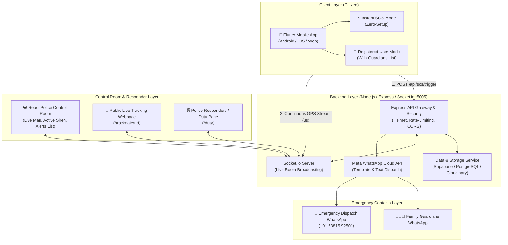
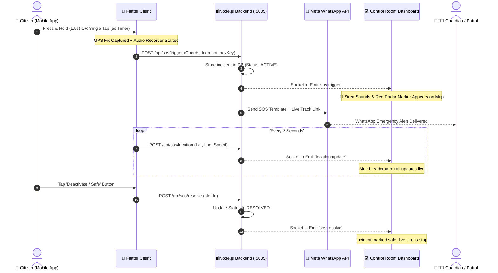

# 🛡️ DEVI (Digital Emergency Verification Interface)
## Complete System Architecture & End-to-End Workflow Documentation

---

## 📑 Table of Contents
1. [Executive Overview](#1-executive-overview)
2. [High-Level System Architecture](#2-high-level-system-architecture)
3. [Repository File & Directory Structure](#3-repository-file--directory-structure)
4. [Frontend Architecture (Flutter)](#4-frontend-architecture-flutter)
   - Dual User Modes (Registered vs. ⚡ Instant SOS)
   - SOS Trigger Mechanisms (Hold vs. Tap 5s Countdown)
   - Background Evidence & Hardware Services
5. [Backend Architecture (Node.js + Express + Socket.io)](#5-backend-architecture-nodejs--express--socketio)
   - Core Modules & Security
   - REST API Endpoints & Webhooks
   - WebSocket Real-Time Event System
   - WhatsApp Cloud API / Automated Emergency Dispatch
6. [Web Control Room Dashboard (React + Vite)](#6-web-control-room-dashboard-react--vite)
7. [Database & Data Models](#7-database--data-models)
8. [End-to-End Emergency Sequence Flow](#8-end-to-end-emergency-sequence-flow)
9. [Safety & Testing Safeguards](#9-safety--testing-safeguards)
10. [Local Development & Environment Setup](#10-local-development--environment-setup)

---

## 1. Executive Overview

**DEVI (Digital Emergency Verification Interface)** is a production-grade, multi-platform Emergency Response and Women's Safety System. It bridges citizens in distress directly with **Family Guardians**, **Police / PCR Responders**, and **Central Control Rooms** within seconds.

### Key Pillars:
- **Instantaneous Activation:** Zero-setup emergency mode ("⚡ Instant SOS") allows immediate trigger without prior registration or login forms.
- **Fail-Safe Dispatch:** Multi-channel alerting combining WhatsApp messages, live GPS breadcrumb streams, continuous audio recording, and WebSocket broadcast.
- **False-Alarm Mitigation:** 5-second cancelable countdown timer + 1.5s press-and-hold tactile confirmation.
- **Real-Time Control Room Operations:** Dedicated Web Command Portal featuring interactive maps, audible priority sirens, and responder dispatch duty logs.

---

## 2. High-Level System Architecture



---

## 3. Repository File & Directory Structure

```text
DEVI_APP/
├── backend/                     # Node.js Express REST API & WebSockets
│   ├── src/
│   │   ├── config/              # Cloudinary, Supabase & DB configurations
│   │   │   ├── cloudinary.js
│   │   │   └── supabase.js
│   │   ├── middlewares/         # Security, JWT auth, rate limiters, error handlers
│   │   │   ├── auth.middleware.js
│   │   │   ├── error.js
│   │   │   └── rateLimiter.js
│   │   ├── routes/              # Express API Routes
│   │   │   ├── auth.routes.js       # Phone login & OTP verification
│   │   │   ├── dashboard.routes.js  # Control room stats & active alerts
│   │   │   ├── health.routes.js     # Health probe
│   │   │   ├── index.js             # Route aggregator
│   │   │   ├── sos.routes.js        # Core SOS trigger, stream & resolve
│   │   │   └── user.routes.js       # User profile & guardian management
│   │   ├── services/            # Business Logic & Integrations
│   │   │   ├── data.service.js      # In-memory + Supabase DB persistence
│   │   │   ├── sms.service.js       # SMS fallback service
│   │   │   ├── socket.service.js    # Socket.io room management & broadcast
│   │   │   └── whatsapp.service.js  # WhatsApp Cloud API automated dispatch
│   │   ├── server.js            # Server entrypoint (Port 5005)
│   │   └── utils/
│   ├── package.json
│   └── .env
│
├── frontend/                    # Flutter Multi-Platform Client (Mobile/Web)
│   ├── lib/
│   │   ├── main.dart            # Flutter entrypoint & Theme initialization
│   │   ├── screens/             # UI Views
│   │   │   ├── splash_screen.dart        # Session verification & animated splash
│   │   │   ├── login_screen.dart         # Phone login & '⚡ Instant SOS' entry
│   │   │   ├── sos_screen.dart           # Core SOS radar screen, timer & triggers
│   │   │   ├── settings_screen.dart      # Profile, Responsive Guardians & Sign Up
│   │   │   ├── profile_screen.dart       # Edit user name, phone & details
│   │   │   ├── history_screen.dart       # Past SOS incident history
│   │   │   ├── guest_screen.dart         # Lightweight guest view
│   │   │   └── responder_duty_screen.dart# Police responder mobile duty screen
│   │   ├── services/            # Hardware & Background Services
│   │   │   ├── api_service.dart          # HTTP client for Backend APIs
│   │   │   ├── app_state.dart            # Central ChangeNotifier global state
│   │   │   ├── emergency_media_service.dart # Background audio & camera capture
│   │   │   ├── location_service.dart     # High-accuracy GPS & live streaming
│   │   │   ├── sms_service.dart          # Native phone call (112) & SMS trigger
│   │   │   ├── socket_service.dart       # Socket.io client for real-time stream
│   │   │   ├── sound_service.dart        # Tactical sirens & countdown audio
│   │   │   └── permission_service.dart   # Camera, mic & location permissions
│   │   ├── theme/               # DEVI design tokens, crimson accents & typography
│   │   └── widgets/             # Reusable UI widgets (DEVI Button, radar circles)
│   └── pubspec.yaml
│
└── web/                         # React Control Room Web Dashboard (Vite)
    ├── src/
    │   ├── pages/
    │   │   ├── DashboardPage.jsx# Central Police Monitoring Console
    │   │   ├── TrackPage.jsx    # Real-time incident live tracking map
    │   │   └── DutyPage.jsx     # Responder officer roster & dispatch
    │   ├── App.jsx              # React Router setup
    │   ├── index.css            # Control room styling & pulsing animations
    │   └── main.jsx
    ├── package.json
    └── vite.config.js
```

---

## 4. Frontend Architecture (Flutter)

### 4.1 Dual User Modes

| Feature | 👤 Registered User Mode | ⚡ Instant SOS (Guest Mode) |
|---|---|---|
| **Entry Point** | Phone OTP Authentication | Single-tap direct bypass button |
| **Setup Required** | Name, Phone, Guardians list | **Zero Setup** (100% instant) |
| **Guardian Alerts** | WhatsApp to personal saved contacts | WhatsApp to central emergency line (+91 63815 92501) |
| **Settings Screen** | Full guardian management & profile | Distraction-free (Guardians card hidden, "Sign Up" button) |
| **Target Use Case** | Everyday commuters, students, workers | Immediate danger, stranger in distress, zero time to register |

### 4.2 SOS Triggering System (`sos_screen.dart`)
To eliminate accidental triggers while guaranteeing instantaneous activation in genuine danger, DEVI uses a **dual-trigger mechanism**:

1. **Tactile Press & Hold (1.5 seconds):**
   - User holds the large circular emergency button.
   - Haptic vibration builds up with dynamic radar wave scaling.
   - At 1500ms, the SOS is instantly fired without countdown.
2. **Single Tap (5-Second Safety Countdown):**
   - Tapping the button launches an audible **5-second cancelable countdown**.
   - Large animated countdown timer overlays the button.
   - User can tap again at any time to cancel false alarms.
   - If not cancelled, the emergency triggers automatically at `0s`.

### 4.3 Background Hardware Services
- **`LocationService`:**
  - Requests `LocationPermission.always` / `whileInUse`.
  - Captures initial high-accuracy fix (`LocationAccuracy.high`).
  - Periodically streams GPS breadcrumbs (`lat`, `lng`, `speed`, `heading`, `accuracy`) every 3 seconds to the backend via WebSocket room.
- **`EmergencyMediaService`:**
  - Silently initializes audio recording in background.
  - Takes evidence camera snapshots when supported.
  - Uploads evidence payloads securely to the server/Cloudinary.
- **`SmsService`:**
  - Native integration for direct telephone dispatch.
  - **Testing Safety Mode:** Direct call to `112` is kept commented on safe HOLD during test sessions.

---

## 5. Backend Architecture (Node.js + Express + Socket.io)

### 5.1 Security & Infrastructure
- **Port:** `5005` (Default)
- **Helmet:** HTTP header protection with custom cross-origin policy for embedded Leaflet/OpenStreetMap tiles.
- **Rate Limiting:** `express-rate-limit` prevents DDoS and API spam on public endpoints.
- **Idempotency Key Verification:** Every SOS trigger payload includes a client-generated UUID idempotency key to prevent double alerts during poor network re-tries.

### 5.2 Key REST API Routes

#### Authentication (`/api/auth`)
- `POST /api/auth/send-otp`: Sends SMS verification code.
- `POST /api/auth/verify-otp`: Validates OTP and returns JWT bearer token.

#### Emergency SOS (`/api/sos`)
- `POST /api/sos/trigger`:
  - Validates victim data, coordinates, and battery level.
  - Stores incident in database with status `ACTIVE`.
  - Emits real-time `sos:alert` to Police Control Room via WebSockets.
  - Dispatches automated WhatsApp messages with Live Tracking URLs.
- `POST /api/sos/location`: Appends live GPS breadcrumbs for an ongoing alert.
- `POST /api/sos/resolve`: Marks incident as `RESOLVED`, archiving tracking data and stopping sirens.
- `GET /api/sos/:alertId`: Returns complete alert status, breadcrumb trail, and media.

#### Control Room Dashboard (`/api/dashboard`)
- `GET /api/dashboard/stats`: Returns count of active alerts, resolved alerts, and online responders.
- `GET /api/dashboard/active-alerts`: List of all currently active SOS emergencies.

### 5.3 WebSockets Real-Time Communication (`socket.service.js`)
- Clients join rooms:
  - `control_room`: Police dashboard receives all new incidents.
  - `sos_${alertId}`: Dedicated incident channel for continuous live GPS tracking.
- Events:
  - `sos:trigger` -> Broadcasts new emergency to control room with audio siren trigger.
  - `location:update` -> Streams user movement every 3s to live tracking map.
  - `sos:resolve` -> Notifies dashboard to close live alert tracking.

### 5.4 WhatsApp Emergency Alert Integration (`whatsapp.service.js`)
When an SOS is triggered, an automated emergency message is fired via Meta WhatsApp Cloud API:
```text
🚨 *EMERGENCY SOS ALERT - DEVI SAFETY SYSTEM* 🚨

Victim Name: [Name / Instant SOS User]
Phone: [Phone Number]
Time: [Current Timestamp]
Battery Level: [Battery %]

📍 Google Maps Location:
https://maps.google.com/?q=[lat],[lng]

🔴 LIVE REAL-TIME RADAR TRACKING:
https://devi.macvelsoftware.com/track/[alertId]

Please take immediate protective action or contact local police!
```

---

## 6. Web Control Room Dashboard (React + Vite)

Running on Port `5173`, the Control Room is designed for emergency dispatchers:
1. **Interactive Multi-Incident Map:** Leaflet/OpenStreetMap with custom animated red markers for active victims and blue markers for police patrol vehicles.
2. **Audible & Visual Priority Sirens:** Automatically sounds an emergency siren upon `sos:trigger` socket event until acknowledged.
3. **Live Track Page (`/track/:alertId`):**
   - Accessible by guardians and police responders.
   - Renders live breadcrumb path showing travel speed, battery discharge rate, and heading.
   - Includes quick-dial buttons to call the victim or nearest police station.
4. **Duty Roster (`/duty`):** Assigns nearby patrol officers to active emergencies.

---

## 7. Database & Data Models

### Incident Entity (`sos_alert`)
```json
{
  "alertId": "sos_1741164920000_abc123",
  "idempotencyKey": "uuid-v4-string",
  "userId": "usr_9876543210",
  "userName": "Instant SOS User",
  "userPhone": "9876543210",
  "isGuest": true,
  "status": "ACTIVE",
  "createdAt": "2026-10-05T12:00:00.000Z",
  "resolvedAt": null,
  "initialLocation": {
    "latitude": 13.0827,
    "longitude": 80.2707,
    "accuracy": 8.5
  },
  "batteryLevel": 84,
  "breadcrumbs": [
    {
      "latitude": 13.0827,
      "longitude": 80.2707,
      "timestamp": "2026-10-05T12:00:00.000Z"
    }
  ],
  "evidenceMedia": {
    "audioUrl": "https://res.cloudinary.com/.../audio.m4a",
    "photoUrl": "https://res.cloudinary.com/.../photo.jpg"
  }
}
```

---

## 8. End-to-End Emergency Sequence Flow



---

## 9. Safety & Testing Safeguards

1. **Real Police Call (112) On Hold:**
   - Direct phone dialing to emergency number `112` is kept commented in `sos_screen.dart` during development to prevent false emergency service dispatches.
2. **Demo Mode Pill:**
   - Visual toggle in Flutter SOS Screen allowing mock testing without triggering live production alerts.
3. **Responsive UI Overflow Protection:**
   - Profile Card and Guardian headers are built with `LayoutBuilder` and `Wrap` widgets to guarantee zero `RenderFlex` overflow errors across arbitrary screen widths.

---

## 10. Local Development & Environment Setup

### Prerequisites
- Node.js >= 18.x
- Flutter SDK >= 3.x
- Google Chrome / Edge for web preview

### Running All 3 Services Concurrently

#### 1. Backend Server
```bash
cd backend
npm install
npm start
# Runs on http://localhost:5005
```

#### 2. Control Room Web Dashboard
```bash
cd web
npm install
npm run dev
# Runs on http://localhost:5173
```

#### 3. Frontend App (Flutter Web / Android)
```bash
cd frontend
flutter pub get
flutter run -d chrome
# Runs on dynamically assigned local port (e.g. http://localhost:60314)
```

---
*Documentation compiled and maintained for the DEVI Women & Citizen Safety Project.*
